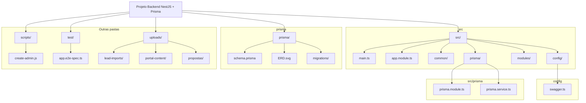

# Estrutura do Projeto

```mermaid
flowchart TB
    Root["Projeto Backend NestJS + Prisma"]

    Root --> Src["src/"]
    Root --> PrismaRoot["prisma/"]
    Root --> Scripts["scripts/"]
    Root --> Test["test/"]
    Root --> Uploads["uploads/"]

    subgraph SRC["src"]
        Src --> Main["main.ts"]
        Src --> AppModule["app.module.ts"]
        Src --> Common["common/"]
        Src --> Config["config/"]
        Src --> Modules["modules/"]
        Src --> PrismaSrc["prisma/"]
    end

    subgraph PRISMA["prisma"]
        PrismaRoot --> Schema["schema.prisma"]
        PrismaRoot --> ERD["ERD.svg"]
        PrismaRoot --> Migrations["migrations/"]
    end

    subgraph CONFIG["config"]
        Config --> Swagger["swagger.ts"]
    end

    subgraph PRISMA_SRC["src/prisma"]
        PrismaSrc --> PrismaModule["prisma.module.ts"]
        PrismaSrc --> PrismaService["prisma.service.ts"]
    end

    subgraph OUTROS["Outras pastas"]
        Scripts --> CreateAdmin["create-admin.js"]
        Test --> E2E["app.e2e-spec.ts"]
        Uploads --> LeadImports["lead-imports/"]
        Uploads --> PortalContentUploads["portal-content/"]
        Uploads --> PropostasUploads["propostas/"]
    end
```